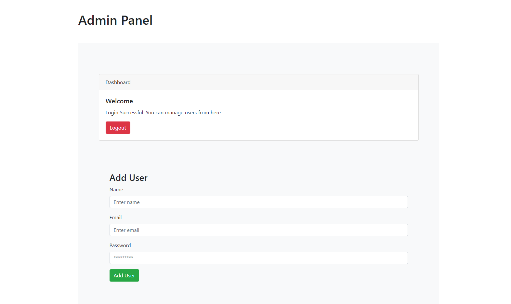
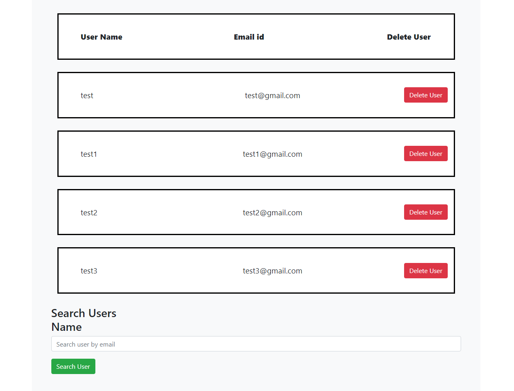

# Project Title

A simple user management system built using Node, Express Js and Mongo DB.

## Description

This project covers user authentication, session handling, role based routing and access control. 

## Getting Started

### Dependencies

Express JS, Passport JS, nodemon, bcrypt.

### Screenshots

 
  
   
